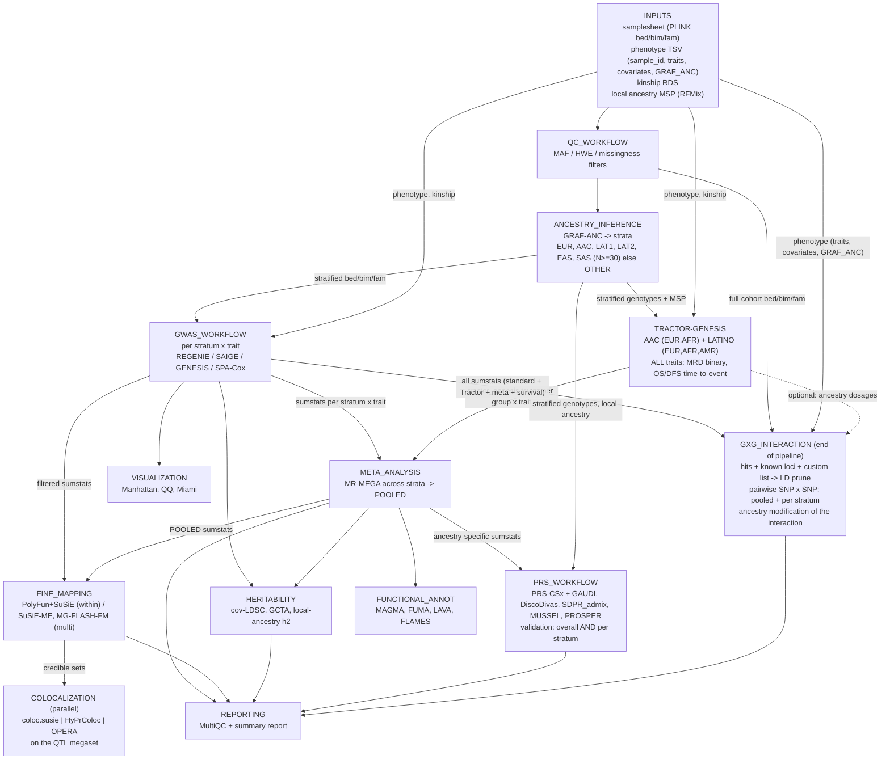
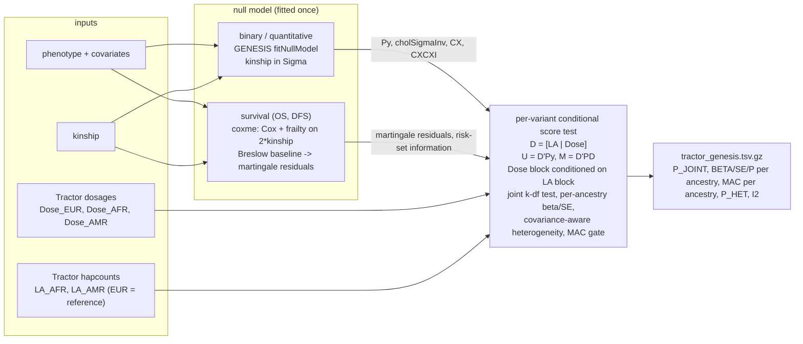
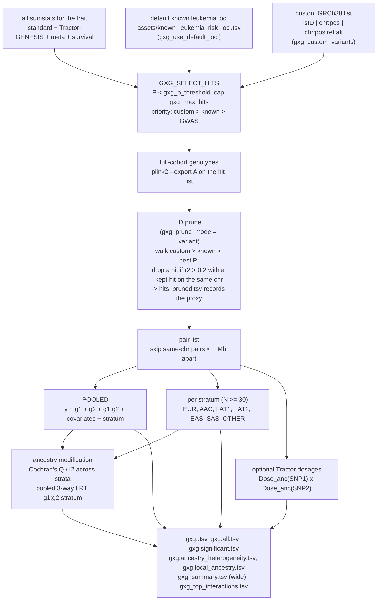
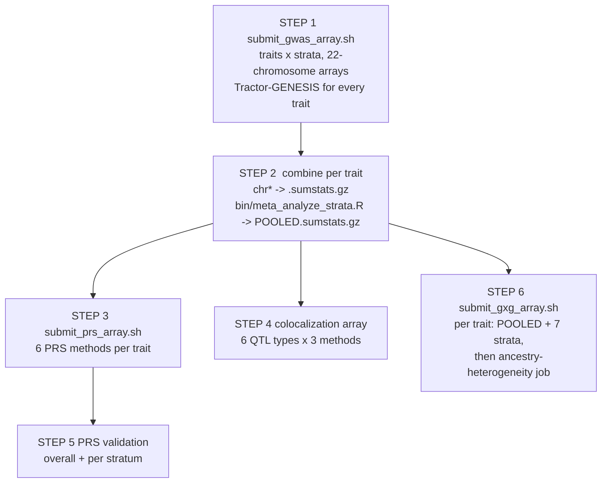

# Pipeline workflow: what happens to the data, module by module

This is the current data flow for the multi-ancestry leukemia GWAS pipeline.
Boxes are Nextflow subworkflows or processes; every arrow is a file handed from
one module to the next. The same steps exist as SLURM array scripts under
`slurm/` (section 6), which call the same `bin/` scripts.

## 1. End-to-end overview

## 2. Module inputs and outputs

| Module (subworkflow / process) | Reads | Writes | Feeds |
|---|---|---|---|
| `INPUT_CHECK` | samplesheet CSV | validated genotype channel | QC |
| `QC_WORKFLOW` | bed/bim/fam | QC'd bed/bim/fam, QC report | ANCESTRY, GxG (full cohort) |
| `ANCESTRY_INFERENCE` | QC'd genotypes, GRAF reference, MSP | `ancestry_calls.tsv`, stratified bed/bim/fam per group, local ancestry channel | GWAS, Tractor, PRS |
| `GWAS_WORKFLOW` (standard) | stratified genotypes x trait, phenotype, covariates, kinship | `<id>.<ancestry>.<trait>.sumstats.gz`, filtered sumstats, significant variants | META, FM, H2, VIS, GxG |
| `PLINK_TO_VCF` -> `TRACTOR_EXTRACT_TRACTS` | AAC and merged LATINO genotypes + MSP; `meta.tractor_pops` | `<id>.ancdose.<k>.tsv.gz`, `<id>.hapcount.<k>.tsv.gz` per ancestry k | TRACTOR_GENESIS |
| `TRACTOR_GENESIS` (`bin/tractor_genesis_adapter.R`) | dosages + hapcounts, phenotype, kinship, covariates; `meta.model` | `<prefix>.tractor_genesis.tsv.gz` (sorted by P_JOINT), `.genomic_order.tsv.gz`, `.top_hits.tsv`, `.significant.tsv`, `.heterogeneous.tsv`, `.<anc>_specific.tsv`, `.null_model.rds` | META, GxG |
| `META_ANALYSIS` | sumstats grouped by trait across strata | MR-MEGA results, heterogeneity table; SLURM path: `bin/meta_analyze_strata.R` -> `POOLED.sumstats.gz` | FM, H2, PRS, FUNC, GxG |
| `FINE_MAPPING` | filtered sumstats, LD reference / cohort LD | credible sets, PIPs | COLOC |
| `COLOCALIZATION` | credible sets or filtered sumstats, QTL megaset (`assets/qtl_datasets/curated_qtl_sources.yml` via `bin/download_qtl_datasets.R`, harmonized by `bin/harmonize_qtl.R`), cohort LD | `*.coloc.tsv`, `*.hyprcoloc.tsv`, `*.opera.tsv`, combined + consensus tables | REP |
| `HERITABILITY` | sumstats, meta results, LD reference | h2 per stratum, local-ancestry h2, genetic correlations | REP |
| `PRS_WORKFLOW` (`bin/calculate_prs_admixed.R` on the SLURM path) | ancestry-specific sumstats, LD reference, stratified genotypes, local ancestry, phenotype | weights and `.sscore` per method, `<prefix>.validation.tsv` (OVERALL + one row per stratum, AUC / R2 / C-index, disparity flags) | REP |
| `FUNCTIONAL_ANNOT` | meta or filtered sumstats | MAGMA / FUMA / LAVA / FLAMES outputs | REP |
| `GXG_INTERACTION` (`bin/run_gxg_interaction.R`) | see section 4 | see section 4 | REP |
| `REPORTING` | everything above | HTML report | user |

## 3. Tractor-GENESIS: one engine for every trait

Every trait goes through the same conditional score test so MRD, DFS and OS
are comparable. The trait's `model` (set in `main.nf` from `binary_traits` and
`survival_traits`) only changes where the projection comes from.

## 4. GxG interaction (end of pipeline)

Models: logistic for binary traits, linear for quantitative, Cox for survival.
Each pair reports Wald and LRT p-values with Bonferroni over pairs and BH FDR.

## 5. Traits, covariates, strata: what is customisable

| Setting | Nextflow | SLURM | Notes |
|---|---|---|---|
| Traits | `phenotype_cols` | `TRAITS_LIST` | any phenotype columns |
| Binary traits | `binary_traits` | everything not in `SURVIVAL_TRAITS` | 0/1 |
| Time-to-event traits | `survival_traits` (+ `survival_time_cols`, `survival_event_cols`) | `SURVIVAL_TRAITS` | default columns `<trait>_time`, `<trait>_status` |
| Covariates | `covariate_cols`, `gxg_covariates` | `COVARIATES` | any phenotype columns |
| Ancestry column | `gxg_ancestry_col` | `ANCESTRY_COL` | GRAF-ANC codes or labels |
| Strata rules | `min_stratum_n`, `bin/ancestry_config.R` | `STRATA_LIST`, `bin/ancestry_config.R` | N < 30 pools to OTHER |
| Known loci | `gxg_known_loci`, `gxg_use_default_loci` | `KNOWN_LOCI`, `GXG_USE_DEFAULT_LOCI` | default table is a starting point; verify positions |
| Custom variants | `gxg_custom_variants` | `GXG_CUSTOM_VARIANTS` | GRCh38, one per line |
| Pair filtering | `gxg_prune_mode`, `gxg_max_pair_r2`, `gxg_min_distance_kb` | `GXG_PRUNE_MODE` | variant = keep strongest per LD cluster |
| Tractor | `tractor_aac_pops`, `tractor_lat_pops`, `tractor_ref_ancestry`, `tractor_mac_min` | `ANCESTRIES` case in `submit_gwas_array.sh` | |

## 6. SLURM orchestration (`slurm/submit_full_pipeline.sh`)

Results land under `results/gwas/<trait>/<stratum>/`, `results/prs/<trait>/`,
`results/coloc/`, `results/gxg/<trait>/`.

## 7. Known drift between the two paths

The Nextflow PRS and colocalization subworkflows (`subworkflows/prs`,
`subworkflows/colocalization`) still call the older per-method modules
(`prs_csx`, `prs_cs`, `gaudi`, `ldpred2`, single-method coloc). The SLURM path
calls the newer scripts (`bin/calculate_prs_admixed.R` with six methods and
stratified validation; `bin/run_colocalization.R` with parallel coloc.susie,
HyPrColoc and OPERA). The GWAS, Tractor-GENESIS and GxG steps are aligned on
both paths. Aligning PRS and colocalization is the next piece of dual-structure
work.
